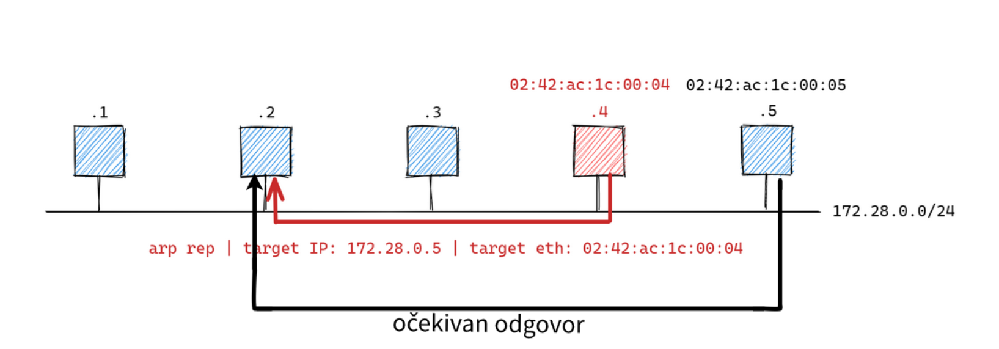

# Lab1

Cilj prve vježbe je bio pokazati ranjivost u osnovnim računalnim mrežama. Izveli smo Man-in-the-middle i DoS (denial of service) napad na računala povezana LAN mrežom.

Koristili smo 3 virtualizirana računala uz pomoć Docker networka zbog jednostavnosti. Sučelje preko kojeg smo upravljali njima je Windows Terminal.

Prvo virtualizirano računalo smo nazvali *station-1*, drugo *station-2* te treće koje predstavlja hakera *evil-station*.

ARP protokol radi tako da npr. *station-1* šalje paket svima u mreži, a točnog primatelja će naći tako što šalje i primateljovu IP adresu.

- IP adresa je vidljiva i nju smo pronašli uz pomoć ping-ovanja
- MAC adresu ostali “stationi” ne vide već ju dobivaju od primatelja da upotpune paket

*evil-station* u tom slučaju se predstavi *station-1* kao *station-2* i obrnuto. Time sva komunikacija ide kroz *evil-station*. Postignut je **Man-in-the-middle napad**.

Ukoliko bi evil-station zaustavio tok komunikacije na jednom kraju, npr. zaustavio tok komunikacije od *station-1* do *station-2*, onda je izveden **DoS napad** (denial of service), napad uskraćivanjem usluge. Te informacije *evil-station* može proslijediti drugim stationima, ugrožavajući integritet.
